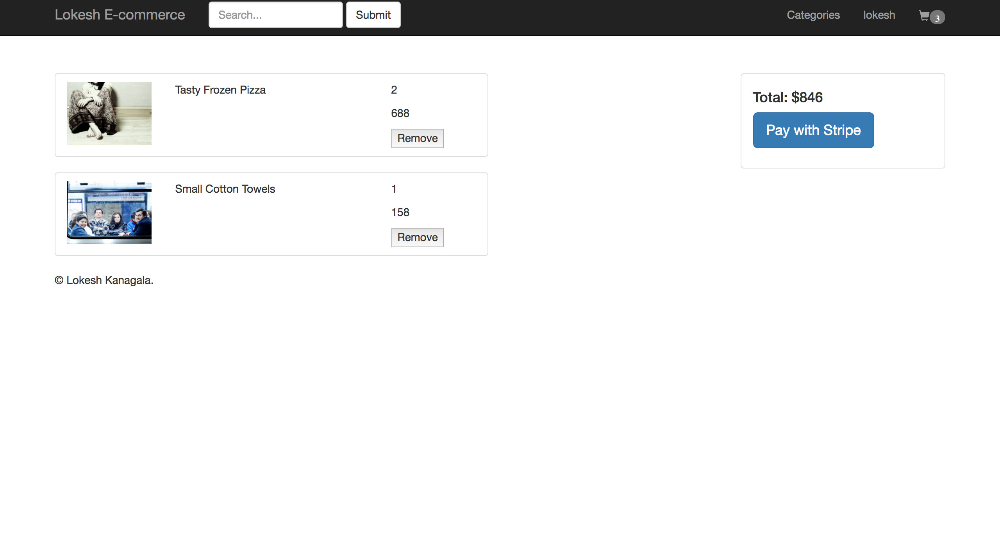

Deployed on Heroku @ [Lokesh-Ecommerce](https://lokesh-ecommerce.herokuapp.com/).  Please Refresh if the application isn't loading. Heroku applications go to sleep if there is an inactivity for 30 minutes.

## How to Run

Run `npm install` to download all the required Node Modules. Once all the dependencies are installed. You can now go and start the application using the command `npm start`.

## What is done here?

##### This web application is a demostration of an e-commerce web application using NodeJS and Elastic Search.  

##### User authentication and Route protection is achieved using PassportJS. MongoDB is used for the database and Faker API is used to populate some fake data into the application.

##### This application will allow user to create an Account and view various products from different categories like gadgets, groceries, clothing, toys etc,. The user can add these products into the cart and can checkout by providing his card details. 

### Since, we are using Faker API here, the product description and image couldn't be relevant. As there are more then 500 products, providing an image and suitable description for all products is a hard task. However, for a real world application, one can load actual/meaningful data into the database.

# Screenshots

## Home Page

Home Page -  This is opening/welcome page to the application

## Signup and Login Pages

Signup and Login Page - Allows users to signup/login into their account

## Dashboard Page 

Dashboard Page - Once user logs in, user will be redirected to dashboard

## Item Page 

Item Page - Allows an user to add a product into his cart

## Cart Page

Cart Page - Gives the user details about items in his cart

## Profile Page

Profile Page - This is the profile page of the user showing his previous checkout informtion.

## Payment Page

Payment Page - Allows the user to pay the amount using his card
